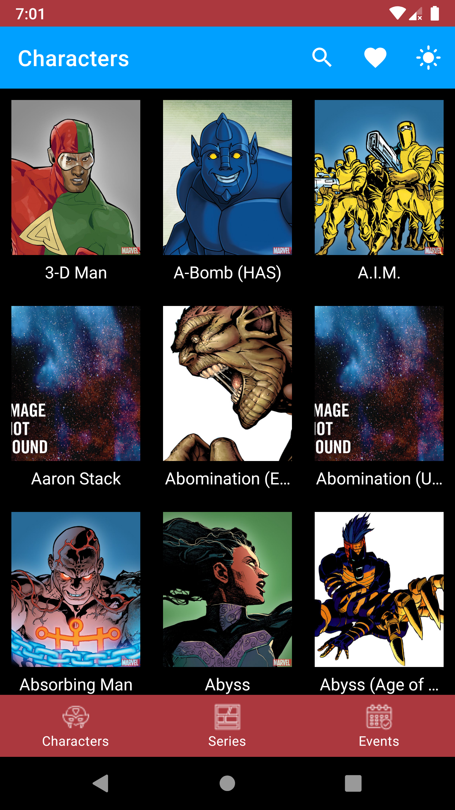
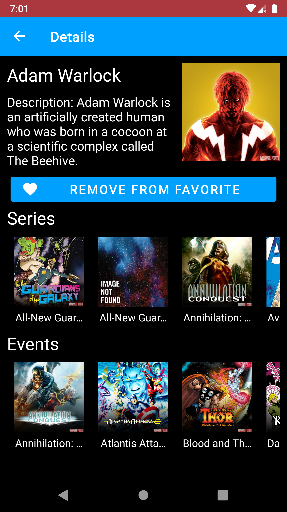
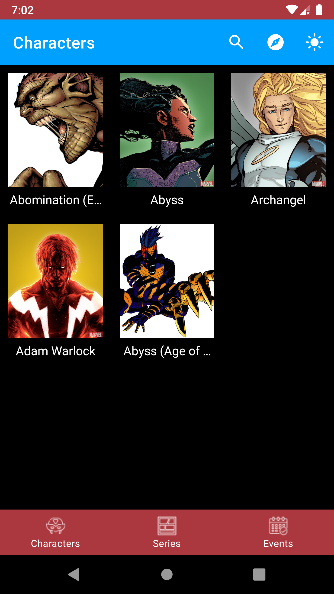
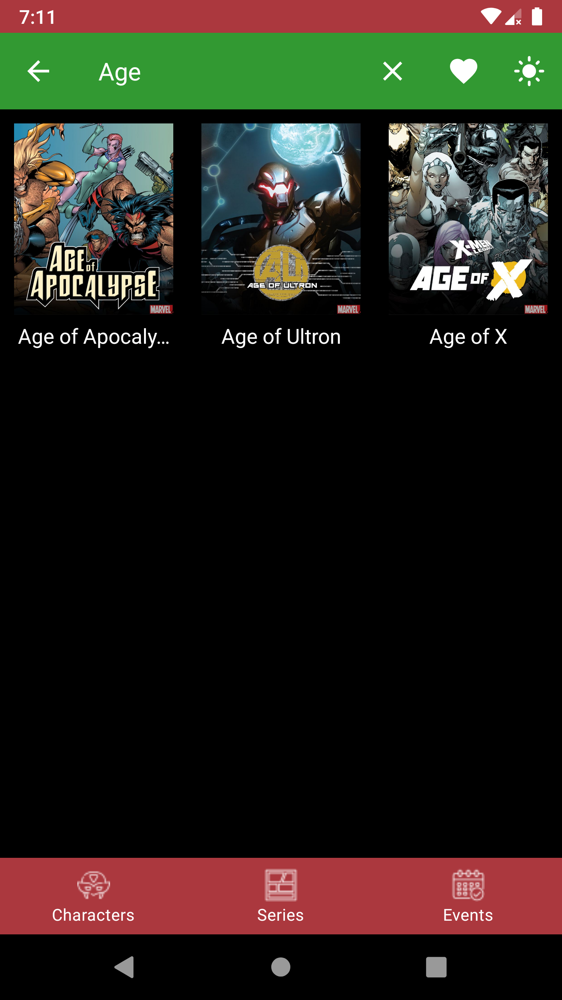

# FlexingMarvel
FlexingMarvel is an Android sample application created for learning purposes only.\
This application is based on [Marvel API](https://developer.marvel.com/) and provides the ability to search info about Marvel characters, series and events.

## Screenshots
<p float="left">
  
   
  
  
</p>

## Tech stack and concepts
* **[Kotlin](https://kotlinlang.org/)** as programming language.
* **[Kotlin coroutines](https://kotlin.github.io/kotlinx.coroutines/kotlinx-coroutines-core/)** as framework for asynchronous jobs.
  * **Flow** (*StateFlow*) as dataholder for UI layer. 
* Single activity support.
  * **[Fragments](https://developer.android.com/jetpack/androidx/releases/fragment)**.
  * **[Navigation components](https://developer.android.com/jetpack/androidx/releases/navigation)**.
* Modern XML UI toolkit.
  * **[Material components](https://material.io/develop/android)**.
  * **ViewBinding** for binding .xml views to objects in Activities and Fragments.
* Api-based remote data layer.
  * **[Retrofit](https://square.github.io/retrofit/)** for network queries.
  * **[GSON](https://github.com/google/gson)** for parsing JSON.
* **[DataStore](https://developer.android.com/jetpack/androidx/releases/datastore)** for working with user preferences (e.g. light/dark mode).
* **[Room](https://developer.android.com/jetpack/androidx/releases/room)** for local data layer.
* **[Paging3](https://developer.android.com/jetpack/androidx/releases/paging)** for pagination. 
* **[Lifecycle components](https://developer.android.com/jetpack/androidx/releases/lifecycle)**.
  * **ViewModel** for implementing MVVM pattern.
* **[Glide](https://github.com/bumptech/glide)** for working with images.
* **[Hilt](https://dagger.dev/hilt/)** for dependency injection.

## Key features
#### i.e. what is unique among other samples?
* **Clean Architecture** (UseCases as an additional layer of abstraction).
* **Pagination** for both network and database (integration with **Room**).
* **MenuProvider API** for options menu configuration.
* **Assisted Injection** in ViewModels. 
* **SavedStateHandle** usage in ViewModels.

## License
```
MIT License

Copyright (c) 2022 Shvyndia Andrii

Permission is hereby granted, free of charge, to any person obtaining a copy
of this software and associated documentation files (the "Software"), to deal
in the Software without restriction, including without limitation the rights
to use, copy, modify, merge, publish, distribute, sublicense, and/or sell
copies of the Software, and to permit persons to whom the Software is
furnished to do so, subject to the following conditions:

The above copyright notice and this permission notice shall be included in all
copies or substantial portions of the Software.

THE SOFTWARE IS PROVIDED "AS IS", WITHOUT WARRANTY OF ANY KIND, EXPRESS OR
IMPLIED, INCLUDING BUT NOT LIMITED TO THE WARRANTIES OF MERCHANTABILITY,
FITNESS FOR A PARTICULAR PURPOSE AND NONINFRINGEMENT. IN NO EVENT SHALL THE
AUTHORS OR COPYRIGHT HOLDERS BE LIABLE FOR ANY CLAIM, DAMAGES OR OTHER
LIABILITY, WHETHER IN AN ACTION OF CONTRACT, TORT OR OTHERWISE, ARISING FROM,
OUT OF OR IN CONNECTION WITH THE SOFTWARE OR THE USE OR OTHER DEALINGS IN THE
SOFTWARE.
```